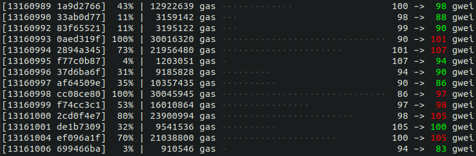

# Next block base fee

> I'll build my own gas price oracle, with blackjack, and hookers!

The main purpose of the script is to listen for new blocks and display the latest base fee and the base fee of the next (pending) block.

### Example output:



Displayed info:

- block number
- block hash
- gas used percentage (out of 30m gas)
- gas used
- block full (all dots = 30m gas used)
- block base fee
- next (pending) block base fee, green if lower than current, red if higher than current

### Usage

```
npm i
PROVIDER_URL=http://your-provider-url npm start
```
